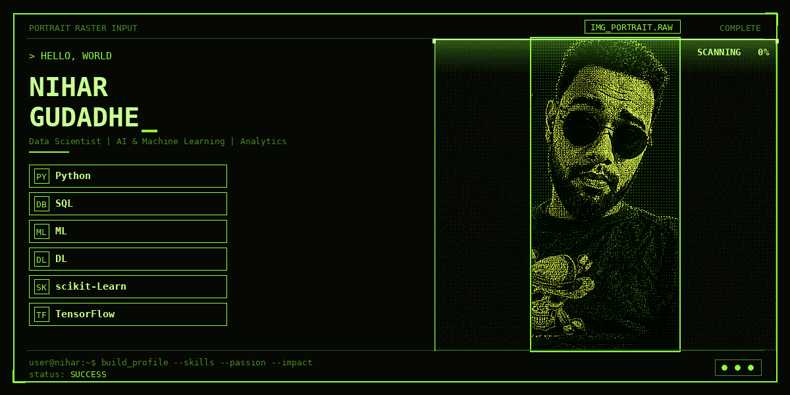

<!-- Profile Views Badge -->

  

### 💼 A **Data Analyst at Influx Control Panel** with **2.6 years of experience**.
### 🔭 Currently focused on **Data Science, transitioning into advanced MLOps and NLP workflows.**

---

  

<table>
  <tr>
    <td><b>🚀 Core Competencies</b></td>
    <td>• Building, training, and deploying scalable AI models using TensorFlow and PyTorch. • Implementing MLOps best practices to streamline the machine learning lifecycle.</td>
  </tr>
  <tr>
    <td><b>📈 Business Impact</b></td>
    <td>• Translating complex datasets into clear, actionable business strategies and automated insights.</td>
  </tr>
  <tr>
    <td><b>🌐 Environment</b></td>
    <td>• Thriving in fast-paced, collaborative environments bridging raw data and production systems.</td>
  </tr>
  <tr>
    <td><b>💬 Ask Me About</b></td>
    <td>Data Analytics, MLOps, NLP, AI & Machine Learning, & transitioning fields</td>
  </tr>
  <tr>
    <td><b>📫 Reach Me At</b></td>
    <td><a href="mailto:gudadhenihar@gmail.com">gudadhenihar@gmail.com</a></td>
  </tr>
  <tr>
    <td><b>⚡ Fun Fact</b></td>
    <td>I treat every dataset like a mystery novel and don't stop until I've found all the hidden insights and patterns.</td>
  </tr>
</table>

---

## 🛠️ Languages and Tools

#### **Languages & Frameworks:**

  
  
  
  
  
  
  
  
  
  
  

#### **Data BI & Analytics:**

  
  
  
    
   

#### **Development & MLOps:**

  
  
  
  
  
  

---

## AI / ML Expertise

| Domain | Proficiency | Details |
|----------|------------|----------|
| Machine Learning | ⭐⭐⭐⭐⭐ | Model Training, Evaluation, Feature Engineering |
| Data Analysis | ⭐⭐⭐⭐⭐ | Pandas, NumPy, Visualization |
| Deep Learning | ⭐⭐⭐⭐☆ | Neural Networks |
| NLP | ⭐⭐⭐⭐☆ | Text Analytics |
| Computer Vision | ⭐⭐⭐☆☆ | Image Processing |
| AI Agents | ⭐⭐⭐☆☆ | AI Automation |
| LLM Integration | ⭐⭐⭐☆☆ | Prompt Engineering, Hugging Face, APIs |
| Deployment | ⭐⭐⭐⭐⭐ | Streamlit, Flask, Docker |

---

## Featured Projects

<b>Laptop Price Prediction</b>

### End-to-End Machine Learning Project

| Category | Details |
|----------|----------|
| Stack | Python, Scikit-learn, Streamlit |
| Scale | Predictive Modeling |
| Performance | E-to-E ML Pipeline |
| Security | Data Validation |
| Impact | Price Estimation Support |
| Repository | [Laptop_Price_Prediction_ML_E2E_Project](https://github.com/NiharGudadhe/Laptop_Price_Prediction_ML_E2E_Project) |

End-to-end machine learning project designed to predict laptop prices based on various hardware specifications.

---

<b>Spam Email Classifier</b>

### Intelligent Classification System

| Category | Details |
|----------|----------|
| Stack | Python, Scikit-learn, NLP |
| Scale | Text Classification |
| Performance | Real-time Filtering |
| Security | Input Sanitization |
| Impact | Automated Spam Detection |
| Repository | [Spam-Email-Classifier-E2E-ML_Project](https://github.com/NiharGudadhe/Spam-Email-Classifier-E2E-ML_Project) |

End-to-end machine learning project utilizing NLP techniques to classify and filter out spam emails.

---

<b>Loan Default Prediction</b>

### Risk Assessment Platform

| Category | Details |
|----------|----------|
| Stack | Python, XGBoost, Streamlit |
| Scale | Financial Analytics |
| Performance | High Accuracy Prediction |
| Security | Secure Data Handling |
| Impact | Credit Risk Evaluation |
| Repository | [Loan-Default-Prediction-XGBoost-Streamlit](https://github.com/NiharGudadhe/Loan-Default-Prediction-XGBoost-Streamlit) |

XGBoost-powered machine learning application featuring an interactive Streamlit dashboard for predicting loan defaults.

## Contribution Activity

## Contribution Snake

  <picture>
    <source
      media="(prefers-color-scheme: dark)"
      srcset="https://raw.githubusercontent.com/kashif7230/kashif7230/output/github-snake-dark.svg"
    />
    <source
      media="(prefers-color-scheme: light)"
      srcset="https://raw.githubusercontent.com/kashif7230/kashif7230/output/github-snake.svg"
    />
    
  </picture>

## 📊 GitHub Stats

<!-- Personal Stats -->

  

## 🌐 Connect With Me

---

> *“Data is the new oil, but only if you refine it into Intelligence.”*

          
